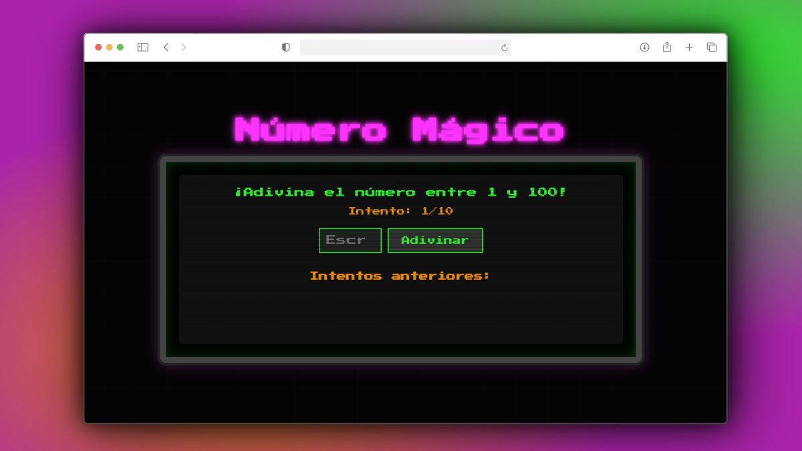

# Número Mágico

Un juego de adivinanza de números con estilo retro arcade, desarrollado en HTML, CSS y JavaScript.



## 📖 Descripción

"Número Mágico" es un juego clásico donde el jugador debe adivinar un número aleatorio entre 1 y 100. Con cada intento, recibirá pistas indicando si el número buscado es mayor o menor. El juego incluye:

- Interfaz con estilo de arcade retro
- Efectos visuales y sonoros para una experiencia inmersiva
- Sistema de intentos limitados (10 oportunidades)
- Historial de números intentados con indicadores visuales
- Diseño responsive para dispositivos móviles y escritorio

## 🚀 Características

- **Estética Retro**: Diseño inspirado en los arcades de los años 80 con fuentes pixeladas y efectos de neón
- **Efectos de Sonido**: Diferentes sonidos para aciertos, fallos, pistas y fin del juego
- **Feedback Visual**: Indicadores de color para saber si el número intentado es mayor o menor
- **Historial de Intentos**: Registro visual de todos los números probados
- **Adaptable**: Diseño responsive que se adapta a diferentes tamaños de pantalla

## 💻 Tecnologías Utilizadas

- HTML5
- CSS3 (Animaciones, Flexbox, Grid)
- JavaScript (ES6+)
- Google Fonts (Press Start 2P)
- API de Audio de HTML5

## 🎮 Cómo Jugar

1. El juego selecciona aleatoriamente un número entre 1 y 100
2. Ingresa tu predicción en el campo de texto
3. Presiona el botón "Adivinar" o la tecla Enter
4. Recibe pistas sobre si el número que buscas es mayor o menor que tu intento
5. Utiliza estas pistas para ajustar tus siguientes intentos
6. ¡Intenta adivinar el número antes de agotar tus 10 intentos!

## 🛠️ Instalación y Ejecución

1. Clona este repositorio:
   ```
   git clone https://github.com/tu-usuario/numero-magico.git
   ```

2. Navega al directorio del proyecto:
   ```
   cd numero-magico
   ```

3. Abre el archivo `index.html` en tu navegador favorito
   
O simplemente visita el [juego en línea](https://tobias-rom3ro.github.io/NumeroMagico/)

## 📁 Estructura del Proyecto

```
numero-magico/
├── index.html          # Estructura HTML principal
├── scripts/
│   └── script.js       # Lógica del juego
├── styles/
│   └── styles.css      # Estilos y animaciones
└── README.md           # Documentación
```

## 🎯 Próximas Mejoras

- [ ] Implementar diferentes niveles de dificultad
- [ ] Añadir tabla de puntuaciones altas
- [ ] Incluir modo multijugador
- [ ] Añadir modo contrarreloj
- [ ] Personalización de colores y temas

---

¡Diviértete jugando al Número Mágico! Si tienes sugerencias o encuentras algún problema, no dudes en abrir un issue.
